# Load Testing Report

## Definition of Terms

- **Virtual Users (VUs)**: Simulated users that generate load on the application. Each VU executes the test script independently, allowing us to simulate concurrent users.
- **Iterations**: The number of times each VU will execute the test script. For example, if we have 100 VUs and 2000 iterations, there will be a total of 200,000 script executions (100 VUs \* 2000 iterations).
- **Checks**: Assertions in the test script that validate the responses from the application. For example, a check might assert that the response status code is 200 or that the response body contains certain data. If the script has 2 checks, each iteration will have 2 checks, and the total number of checks will be (number of VUs) _ (number of iterations) _ (number of checks per iteration).
- **Response Time**: The time it takes for the application to respond to a request. This is typically measured in milliseconds (ms) or seconds (s).
- **Failed Requests**: The number of requests that did not receive a successful response (e.g., HTTP status codes 4xx or 5xx). This can indicate issues with the application under load.
- **95th Percentile (p95)**: The response time below which 95% of the requests fall. This is a common metric used to understand the typical response time while excluding outliers.
- **Max Response Time**: The longest response time recorded during the test. This can indicate the worst-case performance of the application under load.
- **Average Response Time**: The mean response time across all requests. This gives an overall sense of the application's performance under load.
- **Error Rate**: The percentage of failed requests out of the total requests. This can indicate the stability of the application under load. This can be calculated across all checks or for individual checks to identify issues with specific endpoints or functionalities.
- **Database Pooling**: A technique used to manage database connections efficiently. Instead of opening and closing a new connection for each request, a pool of connections is maintained and reused, which can improve performance and reduce the likelihood of connection-related errors under load.

## Definition of Success

For this load testing, the definition of success is as follows:

- The p95 response time should be under 3 seconds. This means that 95% of the requests should receive a response within 3 seconds, which is generally considered acceptable for web applications.
- The error rate should be under 5% for the entire test. This means that less than 5% of all requests should fail, indicating that the application can handle the load without significant issues.

## Bottleneck Report

- With a single container and default database configuration, the application can handle up to 100 VUs with acceptable response times and a low error rate (<1%). However, at 200 VUs, the response times increase significantly and there is a high error rate due to database connection issues.
- Increasing the number of containers to 2 improves the response times and reduces the error rate. There are no errors at 100 VUs.However, at 200 VUs, there are significant number of failed requests (>15%). The logs indicate that database is blocking new connections due to max connection limit being reached.
- Optimizing the database configuration by enabling connection pooling and increasing the max connections allows the application to handle 200 VUs with significantly improved response times and no failed requests. The application can also handle 500 VUs with acceptable response times and no failed requests.

NOTE: The test are run with 2000 iterations and 2000 shortlink in the database. This is the worst possible combination of requests where almost no request are repeated. Since the majority of requests are unique, there should be no significant effect of caching data for this specific suite of tests. In a real-world scenario, there may be more repeated requests which can benefit from caching and further improve response times.

## Running Tests

The test scripts are located in the `k6` directory. The script assumes that the application is running is used the docker compose file in the repo. The docker compose is configured to setup influxdb and grafana. The dashboard used for this test is automatically imported to grafana and can be found under the name [K6 Dashboard 14801](http://localhost:3000/d/ReuNR5Aik/k6-dashboard-14801).

To run the tests, use the following command:
For linux:

```bash
cp .env.sample .env
./run.sh
```

For windows:

```powershell
./run.ps1
```

The sample `.env` file contains the default URLs for the application and InfluxDB when the application is running via provided docker compose file. If the application port or influxdb port is different, update the `BASE_URL` and `INFLUX_DB_URL` in the `.env` file accordingly. Update the vus and number of iterations in `k6/script.js` file as needed.

```js
export const options = {
  vus: 200,
  iterations: 2000,
}
```

## Test Methodology

The number of virtual users (VUs) was set at 50, 100, 200 and 500 with 2000 iterations. The number of iterations was set to total number of urls provided in seed data file so that each url is hit at least once. At the beginning of each test run, it checks the application's health before proceeding. If the application is not healthy, the test will abort immediately. The scripts call two http endpoints in each iteration, the health check endpoint and the redirect endpoint. If there are 2000 iterations in a test run, there will be 4001 total http requests with 2000 health check requests, 2000 redirect check requests and one additional sanity health check at start of the test. The results of the tests are collected and analyzed using InfluxDB and Grafana.

## Scenario 1 - Default Configuration:

This test is run with the default configuration of the application, which includes 1 container and the default database configuration of max_connections = 100 and no database connection pooling. The results of this test will serve as a baseline for comparison with other scenarios.

### 50 VUs, 2000 iterations

- Test Configuration:
  - Virtual Users (VUs): 50
  - Iterations: 2000
  - Cotainers: 1
  - Database Configuration: max_connections = 100 (default), no database connection pooling
- Results:
  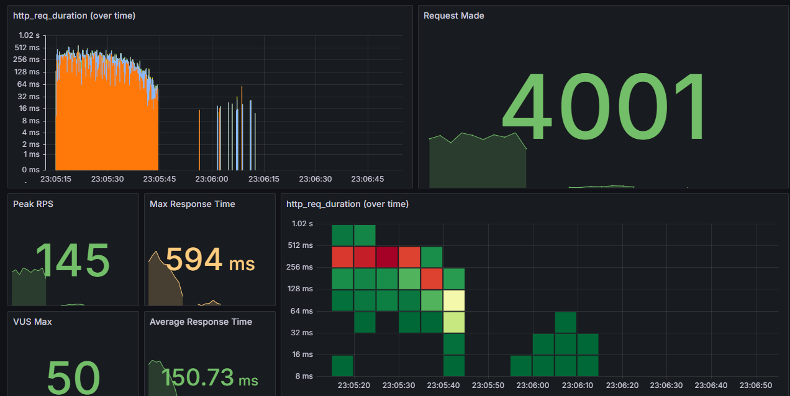
  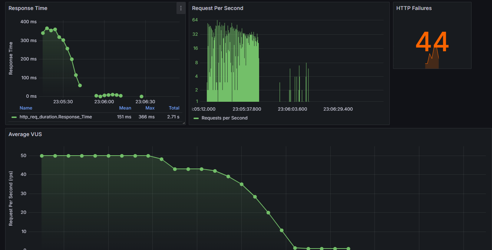
  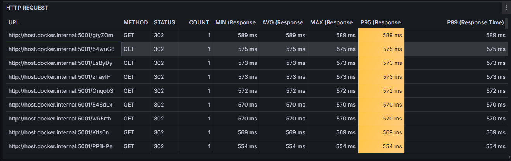
  - Average Response Time: 266.19ms
  - Max Response Time: 594.21ms
  - 95th Percentile: 443.19ms
  - Failed Requests: 44 total,25/2000 (2%) for health check, 19/2000 (1%) for redirect check

- Observations:
  - The application seems to be able to handle 50 VUs fairly well. However there are some failed requests, most of which are due to database connection issues.

### 100 VUs, 2000 iterations

- Test Configuration:
  - Virtual Users (VUs): 100
  - Iterations: 2000
  - Cotainers: 1
  - Database Configuration: max_connections = 100 (default), no database connection pooling
- Results:
  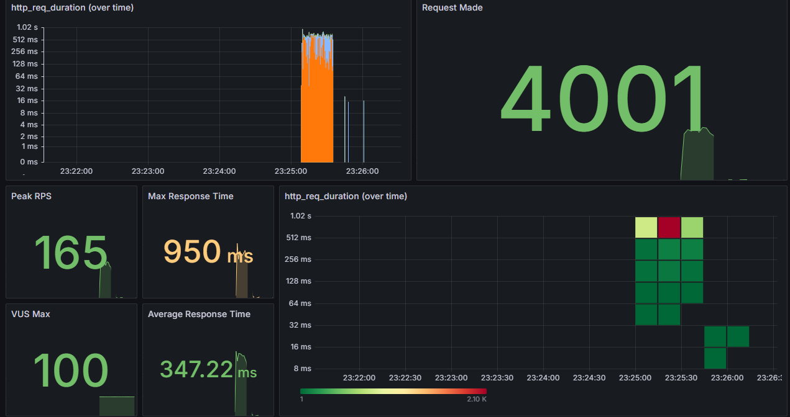
  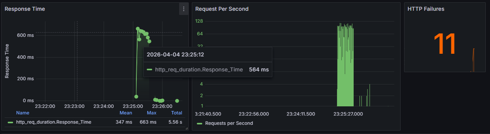
  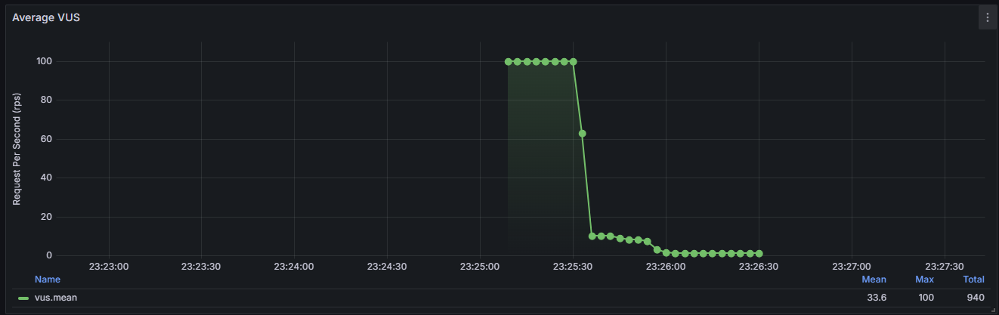
  
  - Average Response Time: 608.93ms
  - Max Response Time: 949.58ms
  - 95th Percentile: 752.26ms
  - Failed Requests: 11 total, 4/2000 (1%) for health check, 7/2000 (1%) for redirect check

- Observations:
  - The application seems to be able to handle 100 VUs fairly well. There are less errors compared to 50 VUs, but the response time has increased.

### 200 VUs, 2000 iterations

- Test Configuration:
  - Virtual Users (VUs): 200
  - Iterations: 2000
  - Cotainers: 1
  - Database Configuration: max_connections = 100 (default), no database connection pooling
- Results:
  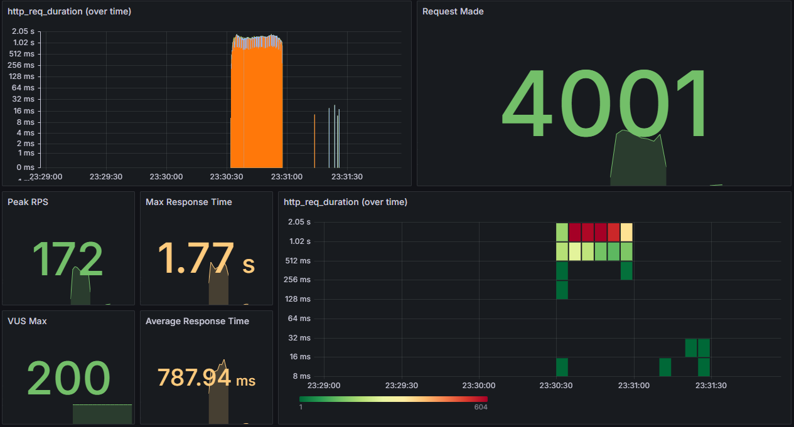
  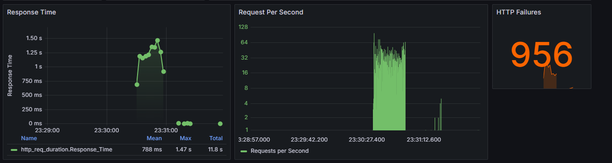
  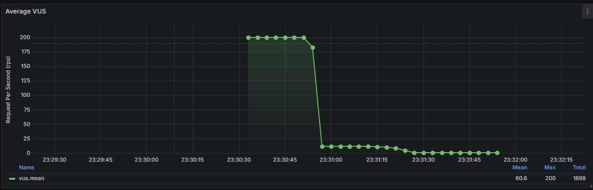
  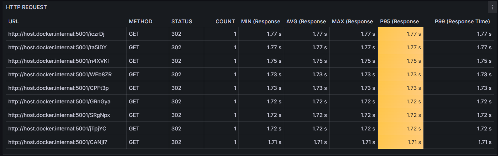
  - Average Response Time: 1.23s
  - Max Response Time: 1.77s
  - 95th Percentile: 1.61s
  - Failed Requests: 956 total,503/2000 (25%) for health check, 453/2000 (23%) for redirect check

- Observations:
  - The application seems to be struggling handle 200 VUs fairly well. The response time has increased significantly and there are more failed requests compared to 100 VUs. The failed requests are mostly due to database connection issues.

## Scenario 2 - Horizontal Scaling:

For this scenario, the number of containers running the application is increased to 2 while keeping the default database configuration. The results of this test will be compared to the default configuration to see if increasing the number of containers has any impact on the performance of the application.

### 50 VUs, 2000 iterations

- Test Configuration:
  - Virtual Users (VUs): 50
  - Iterations: 2000
  - Cotainers: 2
  - Database Configuration: max_connections = 100 (default), no database connection pooling
- Results:
  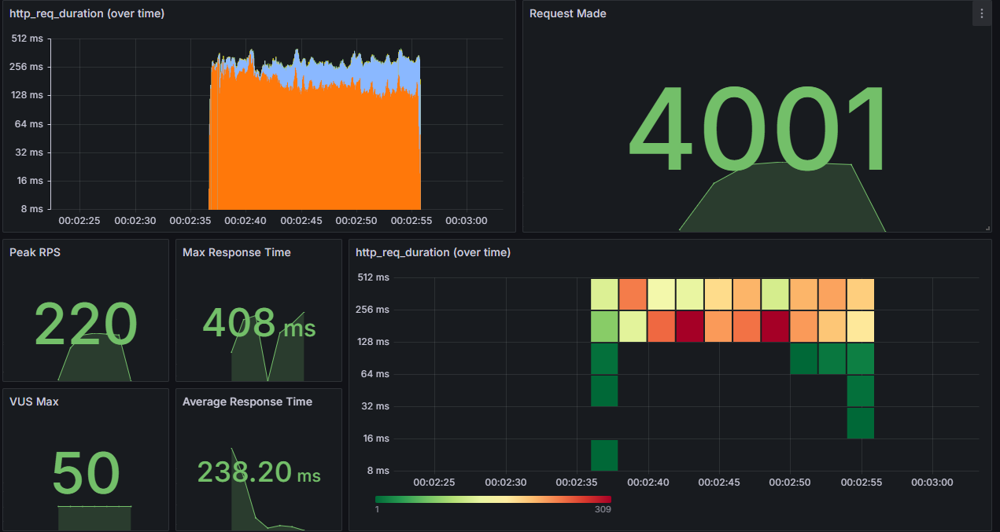
  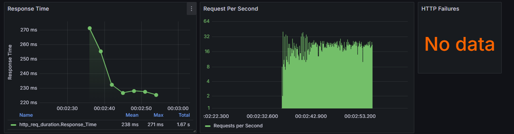
  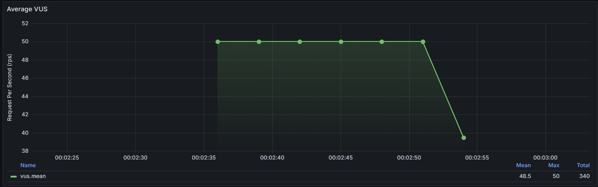
  
  - Average Response Time: 236.64ms
  - Max Response Time: 407.6ms
  - 95th Percentile: 335.43ms
  - Failed Requests: 0

- Observations:
  - With two containers, the applcation can seamlessly handle 50 VUs. The response time has decresed by around 30% compared to baseline and there are no failed requests.

### 100 VUs, 2000 iterations

- Average Response Time: 608.93ms
- Max Response Time: 949.58ms
- 95th Percentile: 752.26ms
- Test Configuration:
  - Virtual Users (VUs): 100
  - Iterations: 2000
  - Cotainers: 2
  - Database Configuration: max_connections = 100 (default), no database connection pooling
- Results:
  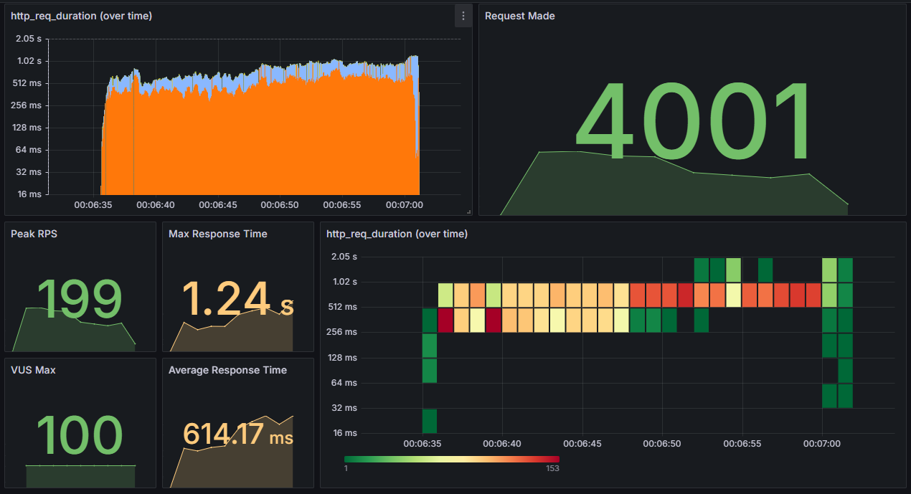
  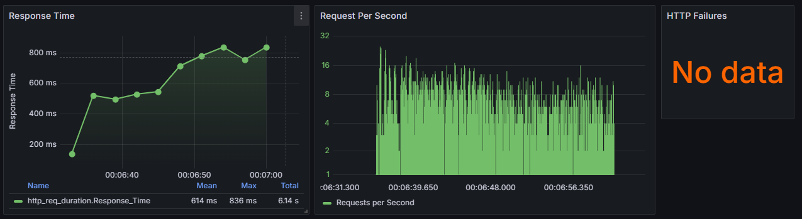
  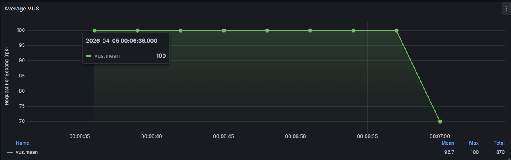
  
  - Average Response Time: 624.14ms
  - Max Response Time: 1.23s
  - 95th Percentile: 970.6ms
  - Failed Requests: 0

- Observations:
  - The response time has slightly increased compared to baseline, but is still within acceptable limit. There are no failed requests. The application seems to be able to handle 100 VUs with two containers.

### 200 VUs, 2000 iterations

- Test Configuration:
  - Virtual Users (VUs): 200
  - Iterations: 2000
  - Cotainers: 2
  - Database Configuration: max_connections = 100 (default), no database connection pooling
- Results:
  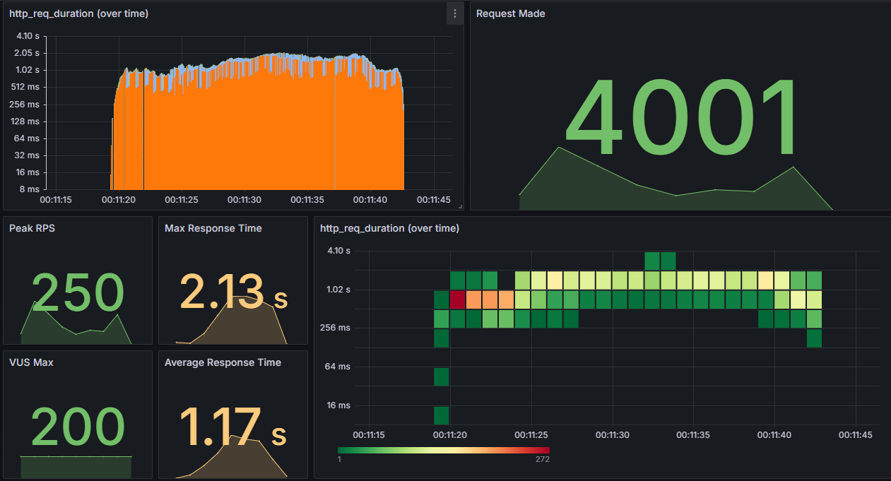
  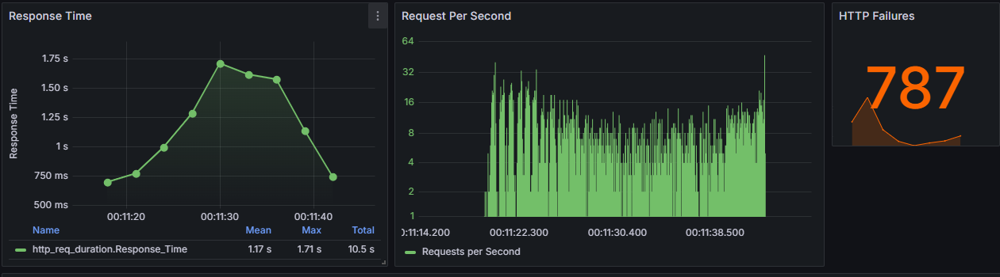
  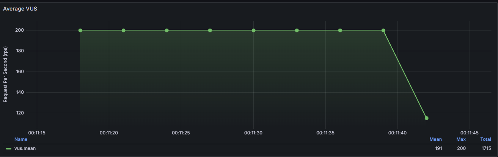
  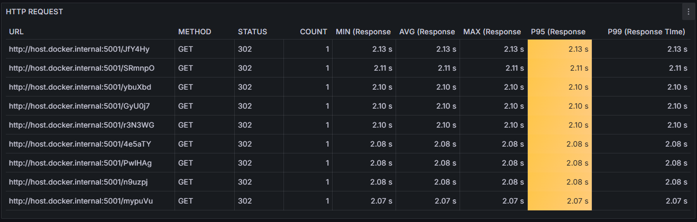
  - Average Response Time: 819.55ms
  - Max Response Time: 1.41s
  - 95th Percentile: 1.2s
  - Failed Requests: 627 total,322/2000 (17%) for health check, 305/2000 (16%) for redirect check

- Observations:
  - The application seems to be struggling handle 200 VUs even with two containers. Both the response times and number of failed requests have decreased compared to baseline, but there are still a significant number of failed requests due to database connection issues. This suggests that the bottleneck is likely at the database level and increasing the number of containers alone may not be sufficient to handle higher loads. Furthermore, increasing the number of containers may lead to increased contention for database connections causing more failed requests.

## Scenario 3 - Database Optimization:

For this scenario, `peewee.PostgresqlDatabase` is replaced with `playhouse.pool.PooledPostgresqlDatabase` to enable database connection pooling. The connection pool is configured with a maximum of 300 connections. The timeout parameter is set to 30 seconds so that pool exhaustion will not immediately lead to failed requests and will instead wait for a connection to be available. The max connections parameter of postgres is increased to 10,000 to ensure that the database can handle the increased number of connections from the connection pool. The test is run with 3 containers as in scenario 2 since increasing the number of containers alone did not seem to be sufficient to handle higher loads.

Since the previous scenario had 0 failures at 100 VUs, the test is only run with 200 and 500 VUs to see if the database optimization can help reduce the number of failed requests and improve response times at higher loads.

### 200 VUs, 2000 iterations

- Test Configuration:
  - Virtual Users (VUs): 200
  - Iterations: 2000
  - Cotainers: 3
  - Database Configuration: max_connections = 10000, pool size = 300
- Results:
  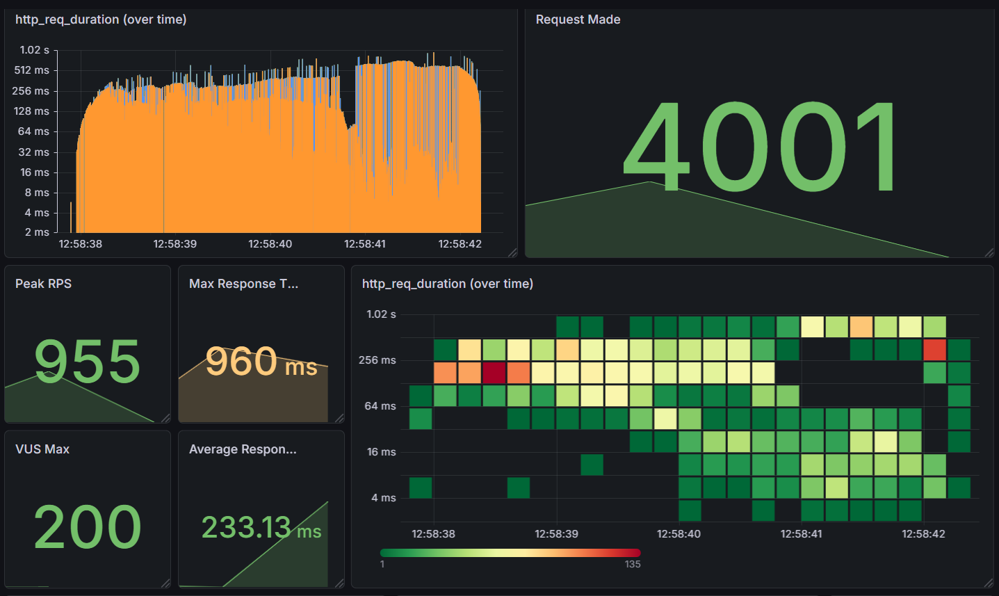
  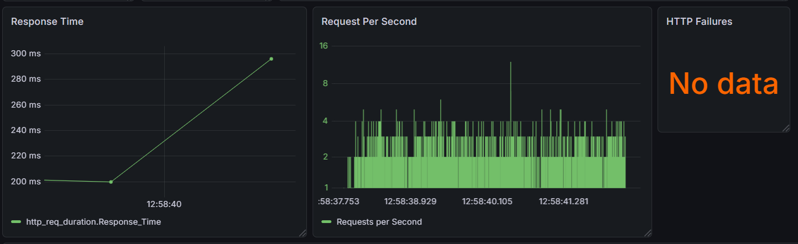
  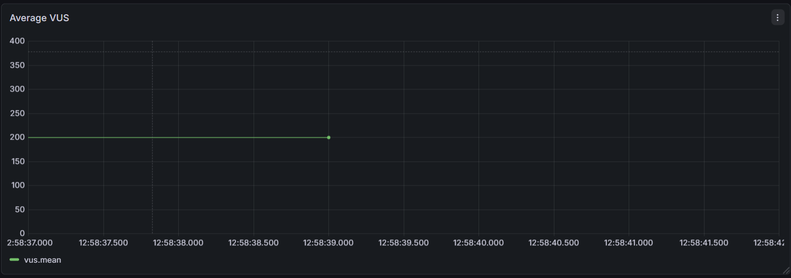
  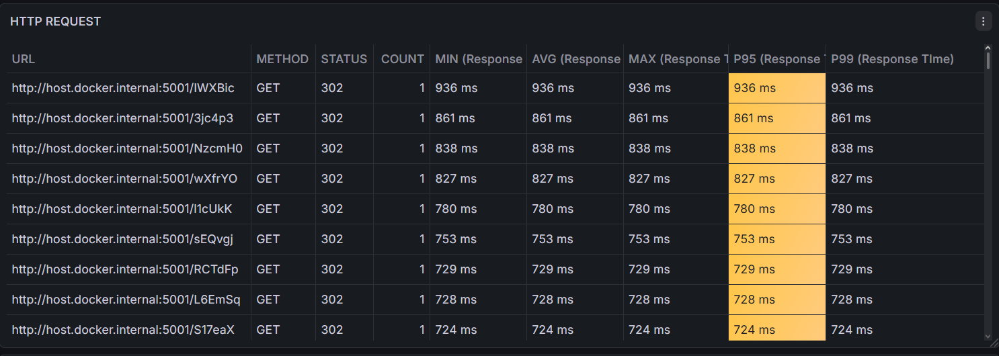
  - Average Response Time: 207.08ms
  - Max Response Time: 960.05ms
  - 95th Percentile: 615.17ms
  - Failed Requests: 0

- Observations:
  - The application can seamlessly handle 200 VUs with the database optimization. The response time has significantly decreased compared to previous scenarios and there are no failed requests. This suggests that the database was indeed the bottleneck in previous scenarios and that optimizing the database configuration can have a significant impact on the performance of the application.

### 500 VUs, 2000 iterations

- Test Configuration:
  - Virtual Users (VUs): 500
  - Iterations: 2000
  - Cotainers: 3
  - Database Configuration: max_connections = 10000, pool size = 300
- Results:
  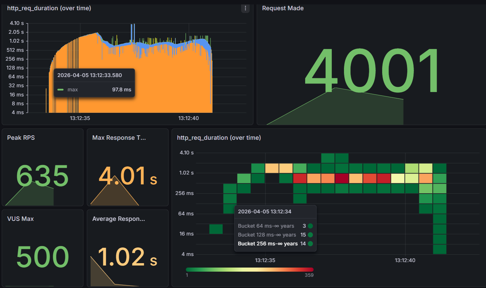
  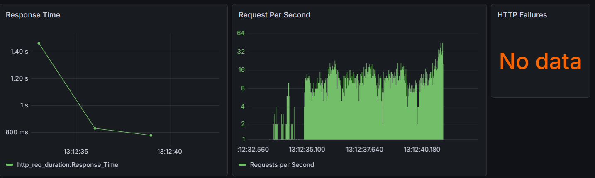
  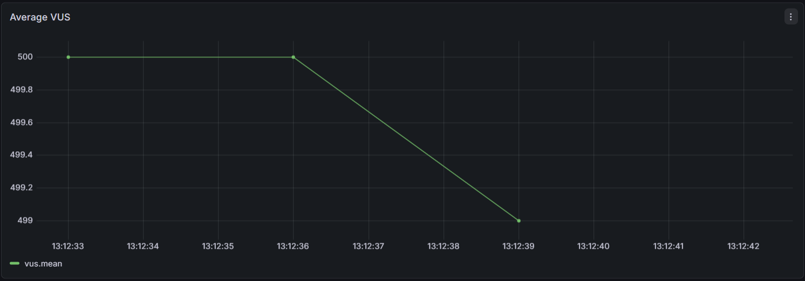
  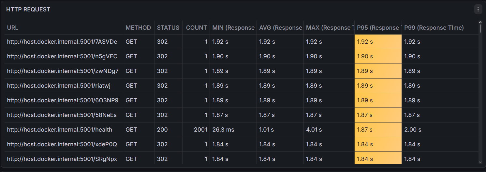
  - Average Response Time: 907.08ms
  - Max Response Time: 4s
  - 95th Percentile: 1.74s
  - Failed Requests: 0

- Observations:
  - The application is able to handle 500 VUs with database optimization, although the max response time has increased significantly. The p95 is still under 3 seconds which is acceptable for this application.
